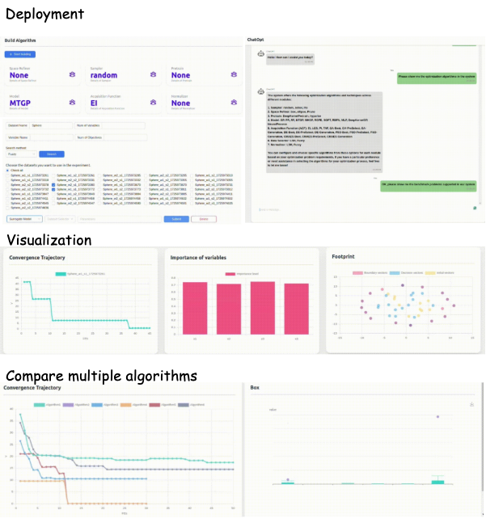

<p align="center">
  <a href="https://maopl.github.io/TransOpt-doc/">
    
  </a>
</p>
<p align="center">
  TransOPT: Transfer Optimization System for Bayesian Optimization Using Transfer Learning<br>
  <a href="https://maopl.github.io/TransOpt-doc/">Docs</a> |
  <a href="https://maopl.github.io/TransOpt-doc/quickstart.html">Tutorials</a> |
  <a href="https://maopl.github.io/TransOpt-doc/usage/problems.html">Examples</a> |
  <a href="">Paper</a> |
  <a href="https://maopl.github.io/TransOpt-doc">Citation</a> |
</p>

<div align="center">

<a href="https://github.com/psf/black"></a>
<a href="https://github.com/psf/black"></a>

</div>


# Welcome to TransOPT!

**TransOPT** is an open-source software platform designed to facilitate the **design, benchmarking, and application of transfer learning for Bayesian optimization (TLBO)** algorithms through a modular, data-centric framework.

## Features

- **Contains more than 1000 benchmark problems covers diverse range of domains**.  
- **Build custom optimization algorithms as easily as stacking building blocks**.  
- **Leverage historical data to achieve more efficient and informed optimization**.  
- **Deploy experiments through an intuitive web UI and monitor results in real-time**.

TransOPT empowers researchers and developers to explore innovative optimization solutions effortlessly, bridging the gap between theory and practical application.

# [Installation: how to install TransOPT](https://maopl.github.io/TransOpt-doc/installation.html)

TransOPT is composed of two main components: the backend for data processing and business logic, and the frontend for user interaction. Each can be installed as follows:

### Prerequisites

Before installing TransOPT, you must have the following installed:

- **Python 3.10+**: Ensure Python is installed.
- **Node.js 17.9.1+ and npm 8.11.0+**: These are required to install and build the frontend. [Download Node.js](https://nodejs.org/en/download/)

Please install these prerequisites if they are not already installed on your system.

1. Clone the repository:
   ```shell
   $ git clone https://github.com/maopl/TransOpt.git
   ```

2. Install the required dependencies:
   ```shell
   $ cd TransOpt
   $ python setup.py install
   ```

3. Install the frontend dependencies:
   ```shell
   $ cd webui && npm install
   ```

### Start the Backend Agent

To start the backend agent, use the following command:

```bash
$ python transopt/agent/app.py
```

### Web User Interface Mode

When TransOPT has been started successfully, go to the webui directory and start the web UI on your local machine. Enable the user interface mode with the following command:
```bash
cd webui && npm start
```

This will open the TransOPT interface in your default web browser at `http://localhost:3000`.


### Command Line Mode

In addition to the web UI mode, TransOPT also offers a Command Line (CMD) mode for users who may not have access to a display screen, such as when working on a remote server.

To run TransOPT in CMD mode, use the following command:

```bash
python transopt/agent/run_cli.py -n Sphere -v 3 -o 1 -m RF -acf UCB -b 300
```

This command sets up a task named Sphere with 3 variables and 1 objectives, using a Random Forest model (RF) as surrogate model and the upper confidence bound (UCB) acquisition function, with a budget of 300 function evaluations.

For a complete list of available options and more detailed usage instructions, please refer to the [CLI documentation](https://maopl.github.io/TransOpt-doc/usage/cli.html).


# [Documentation: The TransOPT Process](https://maopl.github.io/TransOpt-doc/)

Our docs walk you through using TransOPT, web UI and key API points. For an overview of the system and workflow for project management, see our documentation [documentation](https://maopl.github.io/TransOpt-doc/).


<p align="center">

</p>


# Why use TransOPT?

Recent years, Bayesian optimization (BO) has been widely used in various fields, such as hyperparameter optimization, molecular design, and synthetic biology. However, conventional BO is not that efficient, where it conduct every optimization task from scratch while ignoring the experiences gained from previous problem-solving practices. To address this challenge, transfer learning (TL) has been introduced to BO, aiming to leverage auxillary data to improve the optimization efficiency and performance. Despite the potential of TLBO, the usage of TLBO is still limited due to the complexity of advanced TLBO methods. TransOPT, a system that facilitates:

- development of TLBO algorithms;
- benchmarking the performance of TLBO methods;
- applications of TLBO for downstream tasks;

<p align="center">

</p>

**Upper-left:** illustrates the use of a web UI to construct new optimization algorithms by combining different components. **Upper-right:** highlights the application of an LLM agent to effectively manage optimization tasks. **Middle:** shows various visualization results derived from the optimization processes. **Lower:** presents a performance comparison of different TLBO methods.


# Reference & Citation

If you find our work helpful to your research, please consider citing our:

```bibtex
@article{TransOPT,
  title = {{TransOPT}: Transfer Optimization System for Bayesian Optimization Using Transfer Learning},
  author = {Author Name and Collaborator Name},
  url = {https://github.com/maopl/TransOPT},
  year = {2024}
}
```


